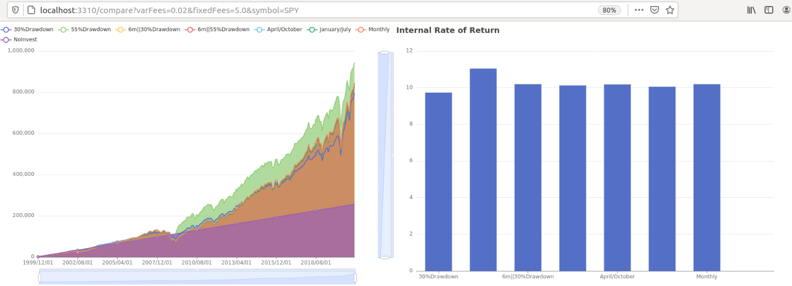

# Financial Calculations (FinCa)

Simulation of passive investment strategies with publicly available data from [AlphaVantage](https://www.alphavantage.co/), visualized with [Apache ECharts](https://echarts.apache.org/en/index.html). This project was written in golang for self-educational purposes.


### Setup
Build the project with
```
go build
```

Obtain your AlphaVantage API key [here](https://www.alphavantage.co/support/#api-key) and set it as environment variable (replacing `DEMO_KEY` with your own key):
```
export AV_API_KEY="DEMO_KEY"
```

Run in the shell which has the API key set with:
```
./finca
```

The port can be changed with the environment variable `ANALYZER_PORT`.

### Background
I am a fan of passive investment: Regularily growing a diversified portfolio of [exchange traded funds (ETFs)](https://en.wikipedia.org/wiki/Exchange-traded_fund). Passive investment accepts that non-professional investors will statistically not be able to outperform the general stock market over long periods of time. This is based on the [efficient market hypothesis](https://en.wikipedia.org/wiki/Efficient-market_hypothesis). Thus I normally only put money into the market, buying new stocks, never selling as an active investor would do.
Nevertheless, the volatility through the recent crisises made me wonder what the best strategy for investing would be.

### Considerations
There were two major questions which I wanted to answer:
 - Could it be advantageous to keep my money in cash until a dramatic down-turn of the market happens? Could this outperform a strategy which invests money periodically regardless of the current state of the market?
 - Given certain costs to investment, what difference does it make to invest every month with a relative fee compared to e.g. twice a year with a fixed fee?

### My personal situation
As you can imagine, I do not want to share all details of my financial situation here. But I can say that I currently save a certain fixed amount of my income every month. At (so far) irregular intervals, I rebalanced my existing ETF stock portfolio by investing what I saved up until then.
However lately, I sometimes wondered _"Would it be smarter to wait a little before investing?"_. Contrary to this sentiment, there is the saying _"Time in the market beats timing the market"_ and I imagine that there is some wisdom in it. Still, where is the lower limit to it? Should I invest every month? To allow myself some peace of mind, I wanted to run the numbers.

### The problem with free financial data
In the beginning, I just planned to write a simulation that would rebalance my real ETF portfolio according to different strategies for longer historic periods. Though I encountered some problems that made me change my approach:
 - Most of the ETFs which I have in my portfolio do not exist for longer than 6-10 years. This seems to short for me to really base an analysis on.
 - Free stock data is not as easy to get as I imagined. In the golden years of the Yahoo! Finance API, it was substantially easier to work with historic stock market data.

After some searching, I decided to make two simplifications which I think will not impact the validity of the general findings:
 - Instead of simulating and rebalancing a complete portfolio, I instead use a single market index ETF as stand-in for a realistic development of the stock market over a longer period of time.
 - The costs per investment which I take into account are the costs which I would pay for rebalancing my real portfolio. I adjust the investment costs for the one reference stock accordingly.
 - The historical end-of-day data which I take into account comes from [AlphaVantage](https://www.alphavantage.co/) and spans a period of 20 years. Ideally, it would be longer, but I did not find free daily data reaching back longer. Ping me if you have free daily EOD data to share :)

## Findings
All findings are based on simulating different strategies on the historical data for the last 20 years of the "SPDR® S&P 500" with the symbol `SPY`. This historical period saw two major criseses:
 - [The global financial crisis of 2007-2008](https://en.wikipedia.org/wiki/Financial_crisis_of_2007%E2%80%932008)
 - [The COVID-19 recession](https://en.wikipedia.org/wiki/COVID-19_recession)

Below is a screenshot with an overview of some select strategies. The assumptions are:
 - An income for investment of 1.000 USD paid on the first day of every month.
 - Relative investment fees of 1.5% for the `Monthly` strategy.
 - Fixed investment fees of 56.0 USD for all other investment strategies independent of the volume.

 

As we can see, a strategy investing at a drawdown of 55% or more would have won out with a margin of 82.000 USD (~9% more than the next best). However this strategy is probably not optimal for the future as discussed below. We can also see that **bi-yearly investment strategies perform slightly better than a monthly-invest strategy** with 25.000 USD margin, which should ease the mind of "minimum effort investors". Another striking (albeit not surprising) figure is the difference between the worst performing investing strategy (`Monthly` with ~852.000 USD) and no investment with 256.000 USD. Said differently, even without accounting for inflation, **someone saving 1.000 USD monthly for 20 years without investing any of it would have missed out on 596.000 USD or a cumulative numeric increase of 332%!**.

### The problem with drawdown strategies
Looking at the overall comparison without further thought, it seems like if there were a best investment strategy based on the maximum drawdown: The strategy which invests only when the drawdown is 55% or larger outperforms other strategies with a significant margin. However this is more of an academical finding which cannot be applied to the future.


Looking at the performance for different minimum drawdown thresholds, we see why it is hard to set an optimal threshold for such a strategy:
 - We see that the "over-performing" strategies do not invest until the maximum drawdown around the 2007-2008 financial crisis where the stock market value dips below the baseline of no investment for the first (and only) time.
 - Some strategies invest "to early" and thereby do not get the large benefit of the 55% threshold.
 - The second-best threshold 45% is not the next cloest to 55%, suggesting that there is no clear rule but rather luck in choosing the right threshold.
 - Even larger thresholds than 55% are never reached in the last 20 years for this reference ETF, rendering the performance of those strategies as bad as the `NoInvest` baseline.

In conclusion, we can say that the 55% threshold strategy outperforms regularily investing strategies only because it is **exactly tuned to exploit specific historic events**. Therefore, we cannot apply such a strategy to the future: Missing the optimal threshold of a future unknown event even by a few percentage points might render the performance far worse than investing periodically.

### Comparing realistic strategies
Drawdown strategies are not a viable option for the future as discussed above. Though which of the remaining strategies is best suited, when we interpret the numbers right?

Looking at the overall comparison above another time, we see that investing always in `April/October` wins out by 15.000 USD over investing always in `January/July`. Those two are the best and the worst six-months-apart pairs of months from my simulations. Here the "specific-historic-event" effect strikes again: The `April/October` strategy is only that good because it invests in two critical times when the markets are near historic lows. Nevertheless, the span between the best and worst pair of months is only 1.8% cumulative over 20 years, thus I would not worry about having chosen the wrong months.

Another psychologically interesting strategy is investing every six months but investing earlier in the event of a dramatic down-turn during the wait period. Excluding the fluke `6m||55%Drawdown` (which exploits the 2007-2008 financial crisis exactly), we still see that the arbitrarily chosen `6m||30%Drawdown` performs almost as good as the best bi-yearly strategy. Thus this is also a viable option which is in line with the "psychological needs" of passive investors (it is hard to hold on to your money when there is "sale at the stock market").


## The project
The main motivation behind this project was practicing some programming in golang while creating something useful for me. Therefore, this project progressed on the side. I raised the test coverage for the strategies to 100%, but many other things are untested, which is fine for a hobby project but for sure not for a production-grade system. Some further functions which are not thoroughly tested are shown below.

The project was setup with a slightly larger scope in mind. This shows e.g. in the fact that retrieving prices is separated out in an extra package and portfolios, strategies etc. are behind interfaces that allow to add other strategies. However I personally do not plan to extend it at this point in time.

### Choosing your stock
By passing a stock with `?symbol=MY_SYMBOL`, you can have all calulations done with `MY_SYMBOL` given that AlphaVantage has historic data for it which is not too far spread out. The time range should adjust automatically. However keep in mind that the backend will not automatically switch back to the default symbol `SPY` when you remove the parameter from the URL.

### Simulating different fees
The fees are currently set to 1.5% for a monthly investment which you can find in many monthly plans of large brokers. Lump investments are set to 56 USD fixed rate. I pay 56 EUR fixed for investing in eight stocks. If you pay more, consider switching your broker :)
You can pass different fees also as URL parameters. Note that your custom fees will apply to all strategies (monthly or not) and that if you specify only one custom fee, the other will default to zero.



### Show stock
You can see the price chart, drawdown and relative change of any stock available in AlphaVantage by going to `/showStock?symbol=MY_SYMBOL`. The charts allow you to zoom the ranges of the axes. This was helpful for me in identifying the academically near-optimal but unrealistic drawdown threshold of 55%.


